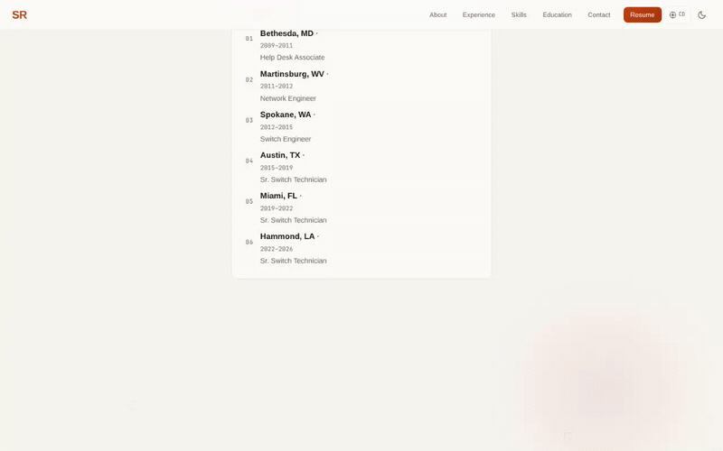

# Career Site

Static personal website hosted directly from this repository.

**Live (GitHub Pages):** <https://lianbeast.github.io/resume-website/>

## Pages

| Page | Purpose |
|---|---|
| `index.html` | Main homepage — approved resume-style layout |
| `immersive-preview.html` | Separate immersive 3D career journey |
| `bold-resume-preview.html` | Separate bold editorial resume treatment |
| `resume-preview.html` | Earlier resume-style preview (kept for reference) |
| `wheel-v2.html` | Standalone 3D skill wheel (search, pause, list fallback) |
| `thank-you.html` | Contact form confirmation page |

## Demo



Watch in full quality: [`assets/demo/demo.mp4`](assets/demo/demo.mp4) · [`demo.mp4` on GitHub](https://github.com/lianbeast/resume-website/blob/main/assets/demo/demo.mp4?raw=true)

## Autostart with systemd (user)

A systemd user service can serve the site on port **2080** automatically after login.

### Service file
```
[Unit]
Description=Career Site HTTP Server (port 2080)
After=network.target

[Service]
Type=simple
WorkingDirectory=~/Applications/Play-Site/Career-Site
ExecStart=/usr/bin/python3 -m http.server 2080
Restart=on-failure
RestartSec=5
StandardOutput=journal
StandardError=journal

[Install]
WantedBy=default.target
```

The file is located at `~/.config/systemd/user/career-site.service`.

### Enable & start
```bash
systemctl --user daemon-reload
systemctl --user enable career-site.service
systemctl --user start career-site.service
```
The service will now start automatically on user login and can be managed with standard `systemctl --user` commands.

### Verify
```bash
curl -s -o /dev/null -w "HTTP %{http_code}\n" http://localhost:8080/
```
Should return `HTTP 200` indicating the site is being served.

## Local development & tests

```bash
npm run dev                     # serve on http://localhost:8080
node scripts/restore.test.cjs   # homepage, resume preview, thank-you
node scripts/immersive.test.cjs # immersive 3D preview
node scripts/bold-resume.test.cjs # bold editorial preview
```

Contact-form tests intercept Formspree requests locally; no real messages are sent.

## Deployment

GitHub Pages publishes the `main` branch automatically. `netlify.toml` retains
the CSP/headers configuration for the previous Netlify hosting; the contact form
uses Formspree (`https://formspree.io/f/mdekbpja`) and works on both hosts.
